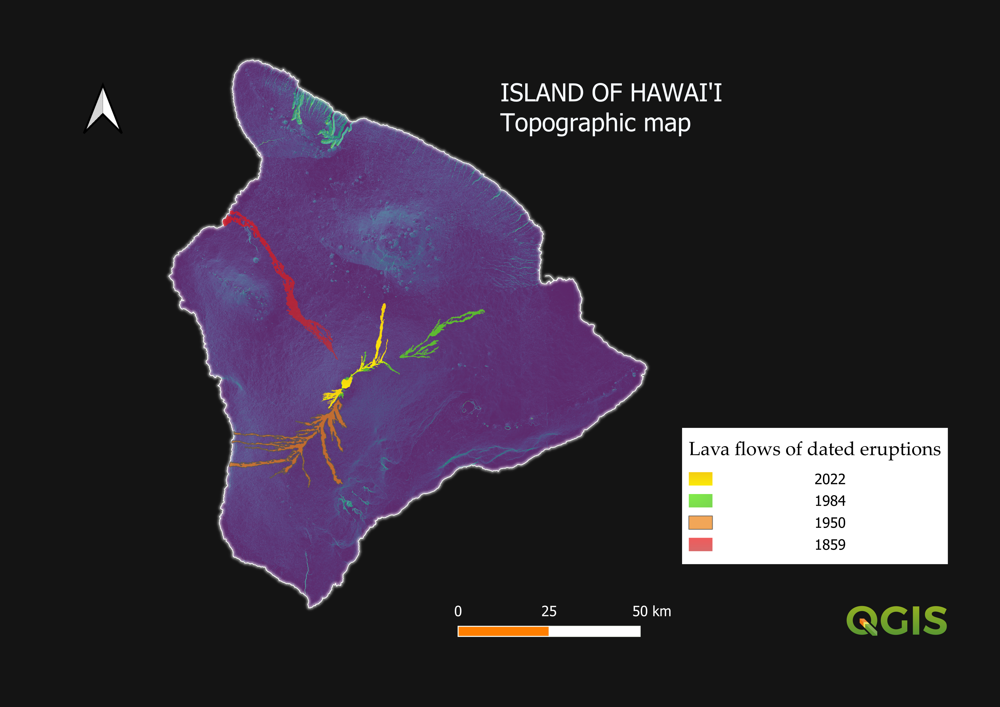

# Hawai'i lava morphology and topography project
This projects uses DEMs and lava flow mapping to analyse correlation between lava morphology and topography.

# Skills used:
- Load and manage shapefiles: coastline .shp filetype
- Load and manage DEMs, (source: Hawaii Statewide GIS Program)
- Manage CRS: projection for Hawai'i EPSG:26905 NAD83/UTN zone 5N
- Build virtual raster to merge DEM tiles .vrt filetype
- Clip raster (merged DEMs) by mask (coastline)
- Raster analysis: Slope, Hillshade
- Overlay .png map (source: USGS HOV maunaloa monitoring project)
- Polygon creation: lava flow tracing, dated eruptions. editing. vector?
- Elevation profiles. Export
- Style layers
- Create print layout, export map .png
- Add scale bar, north arrow (SVGs), legend
