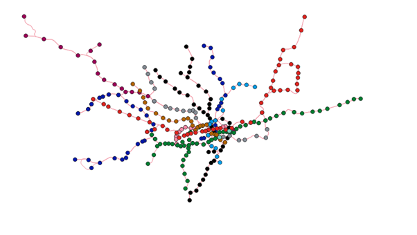
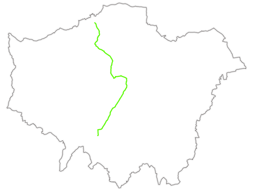

# The Walkable Tube Project

## A GIS network analysis project recreating the London Underground’s Northern Line as a walkable, street‑level route using QNEAT3, OSM data, and custom cartography. Demonstrates data cleaning, spatial analysis, reproducible workflows, and professional map design.

*Computed walking route for the Northern Line (38.66 km), generated using QNEAT3 shortest‑path analysis.*

### I have always been excited by the London Underground, particularly the experience of going below ground, following the schematic map and emerging the other side of London with no tangible experience of the route. The desire to understand how this travel happens geographically has inspired this project. Using QGIS network analysis I have attempted to generate walkable, street-level routes than mimic the London Underground lines, starting with the Northern line. 

 
 

## Data Visualisation 

- All of the datasets have been projected into CRS: EPSG 27700, British National Grid for consistency.
- MSOAs for Greater London were used to provide geographic context.
- The River Thames has been manually traced using OS Open Rivers data as reference. 
- The tube lines have been colourised using the official TfL colour standard.
- The final map shows the computed walking route for the Northern line.

 
 

## Methodology

### Tube network and station layers

- Add station and network datasets (.gpkg, .geojson)
- Clean station data: refactor to remove unnecessary fields, trim text, standardise case. 
- Split multi-line station entries using ; delimiter to ensure each served line became its own feature.
- Filter records by line e.g. 'northern', save selected features into individual layers.
- Adjust station locations to reflect real entrance positions rather than centroids.

### Building the Walkable Street Network

- Import relevant OSM extracts from Geofabrik.
- Merge highway vector layers and clip to a custom polygon approximating the Tube network extent. 
- Exclude non-walkable features (motorway and motorway_link).

 
 
 

  

### Network Analysis

- Use QNEAT3 plugin to compute shortest path (point to point) between consecutive stations. (uses Dijkstra's algorithm).
- Merge resultant segments into single layer to form a continuous walking route.

 

 <> 

### Cartographic Output

- Create a print layout and export as .png

 
 

## Data Sources

- ONS (MSOAs)
- OS Open Rivers (River Thames)
- QuickOSM plugin query (Tube station data)
- Overpass turbo request (Tube network)
- Geofabrik OSM data extracts: Greater London, Hertfordshire, Buckinghamshire, Essex (street network)

 
 

## Key Outcomes

- Generated a walkable analogue of the Northern Line
- Built a reproducible workflow for future lines
- Demonstrated shortest-path network analysis using Dijkstra's algorithm
- Produced a cartographically polished map using official TfL colour standards.

 
 

## Skills Demonstrated

- Cleaning spatial data inside QGIS: refactoring, field calculation, filtering attributes
- Handling of GeoJSON, shapefile, Geopackage formats
- Spatial data acquisition of UK datasets: OS, ONS
- Network analysis using QNEAT3 plugin, shortest path algorithm
- Attribution creation and calculation
- Print layout production

 
 

## Professional Insights and Next Steps

- I gained a lot of confidence in working with attribute tables to clean and organise spatial data, as well as using comparison operations against a verified CSV list of Tube stations to ensure the dataset was complete. (272 stations total!) 
- It was an opportunity to use Network analysis, including Dijkstra's algorithm, which uses vertices from the street network as nodes, examines potential routes between them and uses the shortest / lowest cost route repeatedly to generate a path to the destination station specified.
- I learnt how to better query OSM to specify the data I needed. For instance, using a Greater London location parameter excluded those stations outside the administrative London borders. 
- One major skill i will carry forward to future projects is keeping good file directory organisation. Keeping files in appropriate places and naming them relevantly will cut down on the need to redefine source file locations, especially as the number of files used increases.  
  

- I would like to test the Northern line route. 38.660 km is approximately 24 miles. I estimate this will be walkable over about 8 hours.
- I intend to export the data as directions, and collect data using Strava to later analyse whether the time taken and distance estimates are accurate for each line segment.
- Ultimately I would like to extend the process to the remaining Tube lines, potentially automating the time-consuming process of entering parameters for 'shortest path' for each individual station.
- I'd then like to utilise the data to complete the goal of walking the entire network. 

