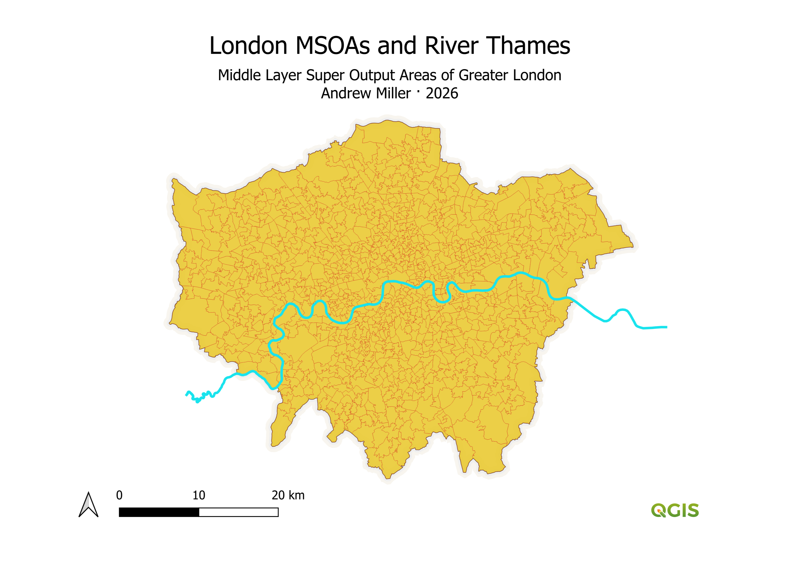
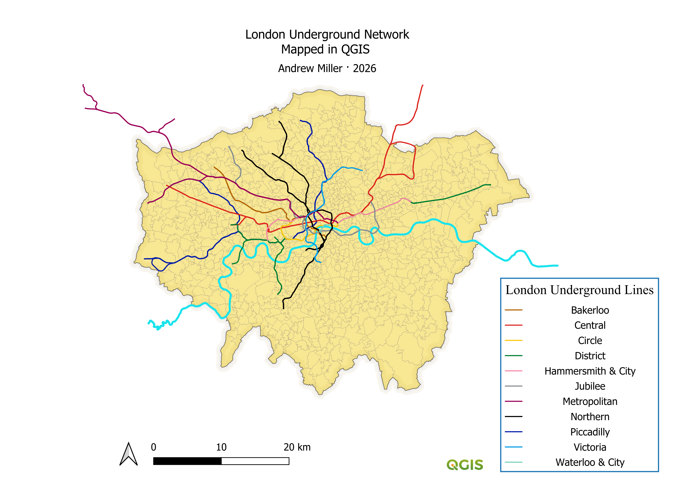
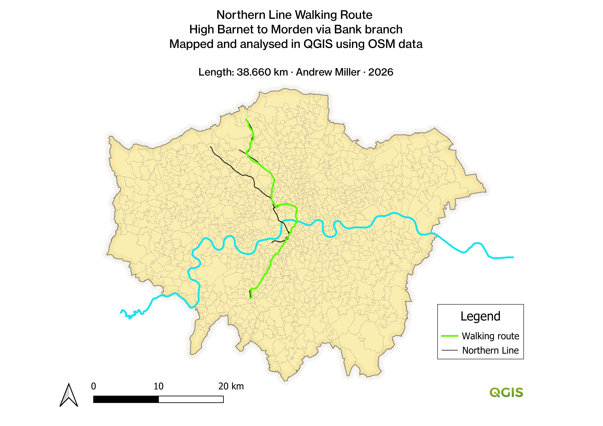

# The Walkable Tube Project

- For this project my intention was to use network analysis to devise walking routes on street level mimicking the underground tube lines.
- I've decided to first focus on the northern line as i am most familiar with it. 

## Data Visualisation 

- All of the data has been projected in CRS: EPSG 27700, British National Grid 

- The graph above shows Greater London split into Middle layer Super Output Areas - defined by the ONS as comprising 2,000 to 6,000 households.
- The River Thames has been digitally traced using OS open rivers data as reference. 

- The tube lines have been colourised using the TfL colour standard, available: https://content.tfl.gov.uk/tfl-colour-standard.pdf

## Methodology
- Walkable street network: import relevant counties from geofabrik.
- merge vectors. create (shapefile) polygon roughly outlining tube network.
- clip to mask (polygon)
- exclude motorway and motorway_link. 

- add layers tube network and stations.
- clean station data. filter by station=subway. Refactoring data. Lower trim 
- split features by character: duplicate for multiple lines served.
- separate by line. e.g. northern.
- vertex editiing comparing with map data, station entrances rather than centroids.
- 

- Networking: QNEST3 plugin. Shortest path (point to point).
- between each station northern line.
- Merge these lines segments into single layer.
- Dijkstra?

- exporting and publish.

  

## Data Sources
- ONS (MSOAs)
- OS Open Rivers (River Thames)
- QuickOSM Plugin query (tube stations)
- Overpass turbo request (tube lines)
- geofabrik OSM data extracts: Greater London, Hertfordshire, Buckinghamshire, Essex (street network)

## Skills 
- Cleaning data inside QGIS: refactoring, field calculation, filtering attributes
- Handling of GeoJSON, shapefile, Geopackage file types
- Spatial data acquisition of UK datasets: OS, ONS
- QNEAT3 Shortest path algorithm 
- Attribution creation and calculation
- Print layout creation

## Real world application 
- Hike!
- The High Barnet to Morden via Bank walking route runs 38.660km or approximately 24 miles.
- At current walking speed a mile takes approximately 20 minutes.
- The route should be walkable in around 8 hours.   

- enable snapping.

